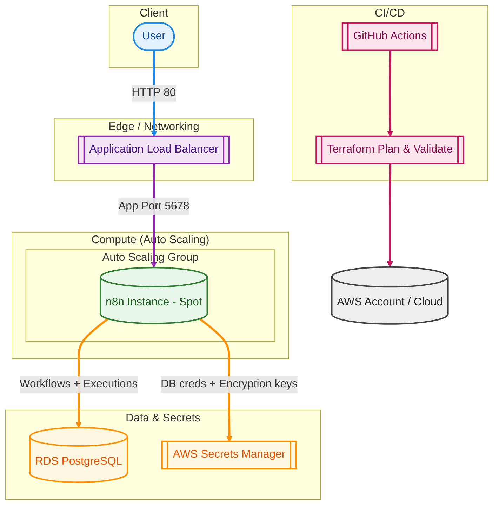

# Resilient & Cost-Optimized n8n Infrastructure

This project demonstrates a production-grade, self-healing deployment of **n8n** on AWS, managed entirely via **Terraform**.

---

## Architecture Overview

The infrastructure is designed for **high availability** and **persistence**, ensuring that the application can recover automatically from instance failures without data loss.

## System Diagram

## Key DevOps Principles Applied
### 1. Self-Healing & Resilience
The compute layer is managed by an Auto Scaling Group (ASG). If the instance fails, becomes unhealthy, or is terminated (even by AWS as a Spot interruption), a new instance is automatically provisioned and joined to the Load Balancer within minutes.

### 2. Zero-Local State (Persistence)
To ensure no data loss during instance termination:

Database: All workflows, executions, and user data are stored in an External AWS RDS (PostgreSQL).

Secrets: Database credentials and encryption keys are fetched at runtime from AWS Secrets Manager, ensuring the instance remains "disposable" and stateless.

### 3. Security-First Approach
Security Group Chaining: Implemented a strict "least privilege" network flow. The RDS only accepts traffic from the EC2 security group, and the EC2 only accepts traffic from the ALB.

IP Whitelisting: The Application Load Balancer is restricted to specific administrative IP ranges to prevent unauthorized access.

### 4. Cost Optimization
EC2 Spot Instances: Utilizes Spot market capacity to reduce compute costs by up to 90% compared to On-Demand instances.

Automated Cleanup: Terraform is used to ensure all resources can be destroyed (terraform destroy) cleanly when not in use.

## Tech Stack
Infrastructure as Code: Terraform

Cloud Provider: AWS (VPC, ALB, ASG, RDS, Secrets Manager)

Containerization: Docker

CI/CD: GitHub Actions (Automated terraform plan & validate)

Application: n8n (Workflow Automation)

## How to Test Resilience (The "Chaos" Test)
One of the core requirements was proving the system can recover from a "hard termination":

Access: Open the n8n dashboard via the ALB DNS URL.

State Creation: Create a user account and save a simple test workflow.

Termination: Go to the AWS EC2 Console and Terminate the running instance.

Recovery: Wait ~3 minutes for the ASG to detect the failure and launch a new Spot instance.

Verification: Refresh the URL. You will be able to log in with your original credentials, and your workflow will be intact.

## CI/CD Pipeline
The project includes a GitHub Actions workflow that:

Performs a terraform validate to ensure code quality.

Runs a terraform plan on every Push or Pull Request, providing visibility into infrastructure changes before they are applied.
